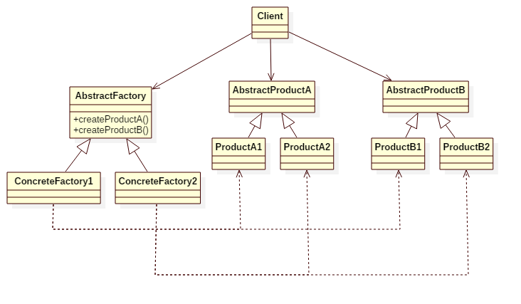

# Abstract Factory Pattern

## Intent
Provide an interface for creating families of related or dependent objects without specifying their concrete classes.

## Applicability
Use the Abstract Factory pattern when

* a system should be independent of how its products are created, composed, and represented.
* a system should be configured with one of multiple families of products.
* a family of related product objects is designed to be used together, and you need to enforce this constraint.
* you want to provide a class library of products, and you want to reveal just their interfaces, not their implementations.
* the lifetime of the dependency is conceptually shorter than the lifetime of the consumer.
* you need a run-time value to construct a particular dependency
* you want to decide which product to call from a family at runtime.
* you need to supply one or more parameters only known at run-time before you can resolve a dependency.

## Structure

